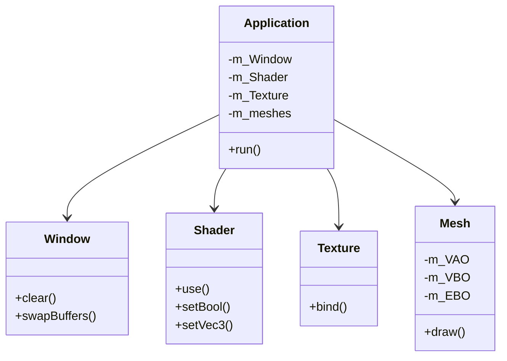

# LearnOpenGL

OpenGL学习项目，按照4个阶段逐步实现3D渲染功能。

## 构建说明

1. 确保安装CMake和Visual Studio
2. 克隆仓库: `git clone https://github.com/AnyaCoder/LearnOpenGL.git`
3. 创建构建目录: `mkdir build && cd build`
4. 生成项目: `cmake ..`
5. 编译: `cmake --build .`

## 新增功能

### 三角形控制
- 按数字键1/2/3切换三种不同形状的三角形
- 按T键切换纹理/纯色模式
- 按R/G/B键改变三角形颜色(红/绿/蓝)

## 项目架构

## 项目阶段规划

1. **基础设置**
   - 创建CMake项目结构
   - 集成GLFW和GLAD
   - 实现窗口创建和主循环

2. **渲染管线**  
   - 实现Shader类管理着色器
   - 创建VBO/VAO/EBO管理系统
   - 渲染第一个三角形

3. **高级功能**
   - 添加纹理支持
   - 实现基础光照(Phong/Blinn-Phong)
   - 添加相机控制系统
   - 实现模型加载(使用assimp)

4. **优化扩展**
   - 添加批处理渲染
   - 实现帧缓冲和后处理效果
   - 添加UI系统(ImGui)

## 依赖项

- GLFW 3.3+
- GLAD
- GLM
- stb_image
- assimp (阶段3)

## 许可证

MIT License
